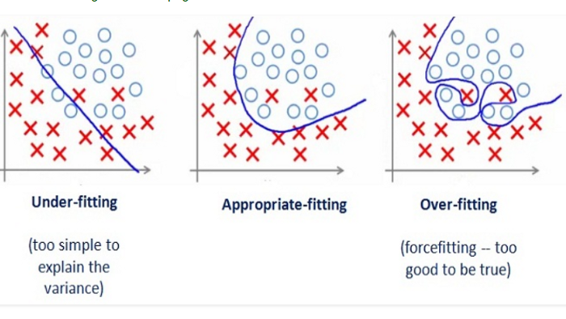

# Underfitting Overfitting

Whenever working on a data set to predict or classify a problem, we tend to find accuracy on first train set, then on test set. If the accuracy is satisfactory, we tend to increase accuracy of data-sets prediction either by increasing or decreasing data feature or features selection or applying feature engineering in our machine learning model. But sometime our model maybe giving poor result.
The poor performance of our model maybe because, the model is too simple to describe the target, or may be model is too complex to express the target,this results in either underfitted model or overfitted model
In machine learning, we predict and classify our data in more generalized way. So in order to solve the problem of our model that is overfitting and underfitting we have to generalize our model

## Example

By looking at the graph on the left side we can predict that the line does not cover all the points shown in the graph. Such model tend to cause underfitting of data .It also called High Bias.
Where as the graph on right side, shows the predicted line covers all the points in graph. In such condition you can also think that it’s a good graph which cover all the points. But that’s not actually true, the predicted line into the graph covers all points which are noise and outlier. Such model are also responsible to predict poor result due to its complexity.It is also called High Variance.
Now, Looking at the middle graph it shows a pretty good predicted line. It covers majority of the point in graph and also maintains the balance between bias and variance.

## Underfitting – High Bias and Low Variance

When the model has fewer features and hence not able to learn from the data very well. This model has high bias.

Techniques to reduce underfitting :
1. Increase model complexity
2. Increase number of features, performing feature engineering
3. Remove noise from the data.
4. Increase the number of epochs or increase the duration of training to get better results.

## Overfitting – High Variance and Low bias

When the model has complex functions and hence able to fit the data very well but is not able to generalize to predict new data. This model has high variance.

Techniques to reduce overfitting :
1. Increase training data.
2. Reduce model complexity.
3. Early stopping during the training phase (have an eye over the loss over the training period as soon as loss begins to increase stop training).
4. Ridge Regularization and Lasso Regularization
5. Use dropout for neural networks to tackle overfitting.